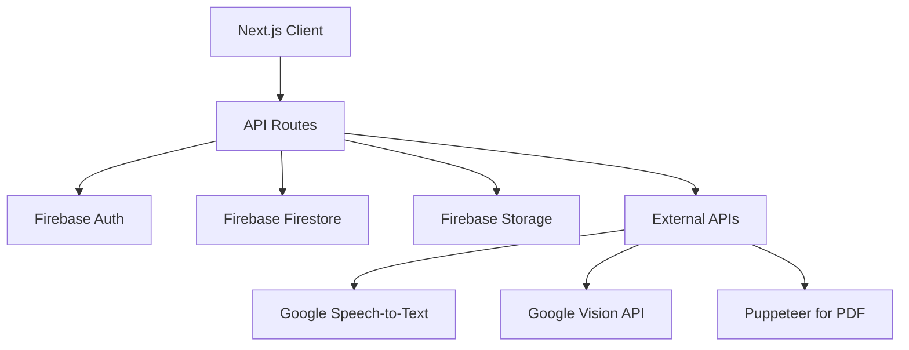

# Smart Invoice App Architecture Plan

## MVP Requirements
- Basic invoice creation
- Expense tracking
- User authentication
- PDF export

## Data Models

### User
- id: string (Firebase UID)
- email: string
- name: string
- created_at: timestamp
- role: 'user' | 'admin'

### Invoice
- id: string
- user_id: string
- client_name: string
- client_email: string
- items: Array<{description: string, quantity: number, price: number}>
- total: number
- status: 'draft' | 'sent' | 'paid'
- created_at: timestamp
- due_date: timestamp

### Expense
- id: string
- user_id: string
- description: string
- amount: number
- category: string
- date: timestamp
- receipt_image_url?: string
- created_at: timestamp

## Component Structure

### Pages
- / (Dashboard) - Overview of invoices and expenses
- /invoices - List and create invoices
- /invoices/[id] - View/edit invoice
- /expenses - List and create expenses
- /profile - User settings

### Components
- Header/Navigation
- InvoiceForm
- InvoiceList
- ExpenseForm
- ExpenseList
- PDFViewer
- VoiceInput
- OCRUpload

## API Routes

### Invoices
- GET /api/invoices - List user's invoices
- POST /api/invoices - Create invoice
- GET /api/invoices/[id] - Get invoice
- PUT /api/invoices/[id] - Update invoice
- DELETE /api/invoices/[id] - Delete invoice
- POST /api/invoices/[id]/pdf - Generate PDF

### Expenses
- GET /api/expenses - List user's expenses
- POST /api/expenses - Create expense
- GET /api/expenses/[id] - Get expense
- PUT /api/expenses/[id] - Update expense
- DELETE /api/expenses/[id] - Delete expense

### Auth
- POST /api/auth/login
- POST /api/auth/logout
- POST /api/auth/signup

### Features
- POST /api/voice-to-text - Process voice input
- POST /api/ocr - Extract text from image
- POST /api/upload - Upload receipt images

## Feature Integrations

### Voice-to-Text
- Use Web Speech API for client-side recording
- Fallback to Google Speech-to-Text API for server-side processing
- Integrate into ExpenseForm for quick entry

### OCR
- Use Tesseract.js for client-side OCR
- Google Vision API for more accurate server-side processing
- Process uploaded receipt images to auto-fill expense fields

### PDF Generation
- Use jsPDF for client-side PDF creation
- Puppeteer for server-side rendering of invoice templates
- Store generated PDFs in Firebase Storage

### Database Integration
- Firebase Firestore for data storage
- Firebase Auth for user management
- Firebase Storage for receipt images and PDFs
- Real-time listeners for live updates

## High-Level Architecture

### Architecture Description
- **Frontend**: Next.js with TypeScript and Tailwind CSS for responsive UI
- **Backend**: Next.js API routes as serverless functions
- **Database**: Firebase Firestore for NoSQL data storage
- **Storage**: Firebase Storage for file uploads
- **Authentication**: Firebase Auth for user management
- **External Services**: Google APIs for voice and OCR, Puppeteer for PDF generation

## Tech Stack Extensions

### Dependencies to Add
- `firebase`: ^10.7.0 - Firebase SDK
- `jspdf`: ^2.5.1 - PDF generation
- `tesseract.js`: ^5.0.4 - OCR processing
- `puppeteer`: ^21.6.1 - Server-side PDF rendering
- `@google-cloud/speech`: ^6.2.0 - Google Speech API
- `@google-cloud/vision`: ^4.0.2 - Google Vision API
- `react-speech-recognition`: ^3.10.0 - Voice input hook

### Dev Dependencies
- `@types/jspdf`: ^2.3.0

### Environment Variables
- FIREBASE_API_KEY
- FIREBASE_AUTH_DOMAIN
- FIREBASE_PROJECT_ID
- GOOGLE_APPLICATION_CREDENTIALS (for APIs)